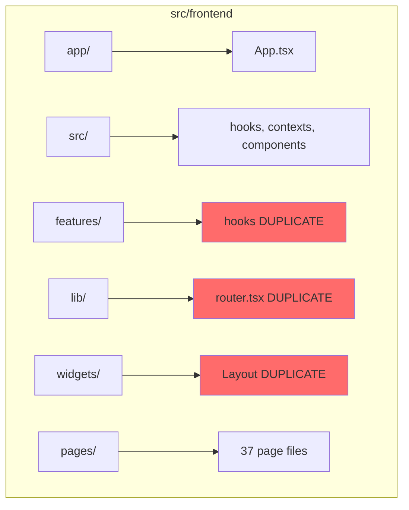

# Code Organization Audit Report

**Project:** Cybin Enterprises  
**Audit Date:** 2026-03-15  
**Auditor:** Systems Architecture Review

---

## Executive Summary

This audit evaluates the code organization of the Cybin Enterprises frontend project. The codebase exhibits **severe structural issues** that significantly impact maintainability, developer experience, and long-term project health.

### Overall Organization Score: **4.5/10 (Poor)**

---

## Critical Issues Found

### 1. Code Duplication (Severity: CRITICAL)

The project contains identical files duplicated across multiple directories:

| Duplicate Set | Files | Status |
|---------------|-------|--------|
| **useActor hook** | `src/frontend/src/hooks/useActor.ts` (57 lines) <br> `src/frontend/features/hooks/useActor.ts` (57 lines) | IDENTICAL |
| **useThemeColors hook** | `src/frontend/src/hooks/useThemeColors.ts` (36 lines) <br> `src/frontend/features/hooks/useThemeColors.ts` (36 lines) | IDENTICAL |
| **useInternetIdentity hook** | `src/frontend/src/hooks/useInternetIdentity.ts` (315 lines) <br> `src/frontend/features/hooks/useInternetIdentity.ts` (315 lines) | LIKELY IDENTICAL |
| **useSiteSettings hook** | `src/frontend/src/hooks/useSiteSettings.ts` (151 lines) <br> `src/frontend/features/hooks/useSiteSettings.ts` (151 lines) | LIKELY IDENTICAL |
| **router.tsx** | `src/frontend/src/lib/router.tsx` (258 lines) <br> `src/frontend/lib/router.tsx` (258 lines) | IDENTICAL |
| **ThemeContext** | `src/frontend/app/contexts/ThemeContext.tsx` (110 lines) <br> `src/frontend/src/contexts/ThemeContext.tsx` (107 lines) | NEARLY IDENTICAL |
| **Layout.tsx** | `src/frontend/src/components/Layout.tsx` <br> `src/frontend/widgets/layout/Layout.tsx` | LIKELY DUPLICATED |
| **backend.ts mocks** | `src/frontend/backend.ts` <br> `src/frontend/mocks/backend.ts` <br> `src/frontend/src/mocks/backend.ts` | 3 VERSIONS |

**Impact:** 
- 12+ files duplicated (thousands of lines)
- Which version is the "source of truth"?
- Bug fixes must be applied in multiple places
- Increases bundle size risk

---

### 2. Directory Structure Inconsistency (Severity: HIGH)

The project has **no consistent architectural pattern**:

```
src/frontend/
├── app/           # Contains App.tsx + ThemeContext
├── src/           # Contains hooks, components, contexts (REDUNDANT with root)
├── features/      # Contains hooks (DUPLICATE of src/hooks)
├── pages/         # All pages flat in root (37 files)
├── pages/home/    # Home page sub-components
├── pages/admin/   # Admin page sub-components
├── shared/        # UI components (shadcn/ui)
├── widgets/       # Contains Layout
├── lib/           # Router, theme, utilities
├── components/    # (appears empty or minimal)
├── contexts/      # (appears empty)
├── data/         # (appears empty)
├── entities/     # (empty)
├── services/    # (empty)
├── stores/      # (empty)
├── styles/      # (empty)
├── types/       # (empty)
└── config/      # (empty)
```

**Problems:**
- 10+ empty directories remain as "architectural placeholders"
- `app/` vs `src/` vs root-level separation is unclear
- Pages at `src/frontend/pages/` but imports from `../widgets/layout/Layout`
- Mixed use of flat and nested structures

---

### 3. Import Path Inconsistency (Severity: HIGH)

The tsconfig defines `@/*` to resolve to root, but imports use inconsistent patterns:

```typescript
// App.tsx uses:
import { ThemeProvider } from "@/src/contexts/ThemeContext";  // @/src
import { HashRouter } from "@/lib/router";                    // @/lib (root)
import Layout from "../widgets/layout/Layout";                  // relative
import AboutPage from "../pages/AboutPage";                    // relative

// Layout.tsx uses:
import { useTheme } from "@/src/contexts/ThemeContext";        // @/src
import { useLiveImageSettings } from "@/src/hooks/...";        // @/src
import { Link, useLocation } from "@/lib/router";              // @/lib

// HomePage.tsx uses:
import { useSeo } from "@/src/hooks/useSeo";                   // @/src
import { HeroSection } from "./home/HeroSection";              // relative
```

**Impact:**
- Confusion about which imports are "correct"
- Refactoring is error-prone
- IDE autocomplete inconsistent

---

### 4. Empty/Unused Directories (Severity: MEDIUM)

The following directories exist but appear unused or minimal:

| Directory | Status | Recommendation |
|-----------|--------|----------------|
| `src/frontend/components/` | Mostly empty | Remove |
| `src/frontend/contexts/` | Empty | Remove |
| `src/frontend/data/` | Empty | Remove |
| `src/frontend/entities/` | Empty | Remove |
| `src/frontend/services/` | Empty (referenced in tsconfig but unused) | Remove |
| `src/frontend/stores/` | Empty | Remove |
| `src/frontend/styles/` | Empty | Remove |
| `src/frontend/types/` | Empty | Remove |
| `src/frontend/config/` | Empty | Remove |
| `src/frontend/pages/pages/` | Empty folder | Remove |

---

### 5. Theme System Implementation (Severity: MEDIUM)

**Good:**
- `src/frontend/lib/theme/tokens.ts` provides centralized design tokens (114 lines)
- `src/frontend/lib/theme/tokens.css` defines CSS variables properly
- ThemeContext exists with light/dark mode support

**Issues:**
- `useThemeColors` hook returns hardcoded color mappings that duplicate CSS variables:
  ```typescript
  // This defeats the purpose of CSS variables!
  textPrimary: isLight ? "var(--cybin-text-primary)" : "var(--cybin-text-primary)"
  ```
- The `useThemeColors` hook is duplicated
- Some components use Tailwind classes (`dark:bg-cybin-navy`) instead of CSS variables

---

### 6. Backend Structure (Severity: LOW)

```
src/backend/
├── main.mo              # Motoko canister (1317 lines)
├── backend.wasm         # Empty/minimal
└── system-idl/          # IC canister interface definition
```

**Assessment:** Backend is minimal - likely placeholder for IC integration. No issues identified.

---

## Scoring Breakdown

| Category | Score | Weight | Weighted |
|----------|-------|--------|----------|
| Code Duplication | 2/10 | 30% | 0.60 |
| Directory Structure | 4/10 | 25% | 1.00 |
| Import Consistency | 4/10 | 20% | 0.80 |
| Empty Directories | 5/10 | 10% | 0.50 |
| Theme Implementation | 6/10 | 10% | 0.60 |
| Backend | 9/10 | 5% | 0.45 |
| **TOTAL** | | 100% | **4.5/10** |

---

## Recommended Actions

### Phase 1: Eliminate Duplication (Critical)

1. **Consolidate hooks** - Pick ONE location (`src/hooks` or `features/hooks`), delete the other
2. **Consolidate router** - Pick ONE location (`src/lib` or `lib`), delete the other
3. **Consolidate ThemeContext** - Pick ONE location, merge differences, delete other
4. **Consolidate Layout** - Determine canonical Layout, delete duplicate
5. **Audit backend.ts/mocks** - Determine which is used, delete extras

### Phase 2: Clean Structure

1. **Remove empty directories:**
   ```bash
   rmdir src/frontend/components src/frontend/contexts src/frontend/data \
         src/frontend/entities src/frontend/services src/frontend/stores \
         src/frontend/styles src/frontend/types src/frontend/config
   ```

2. **Adopt consistent import pattern:**
   - Use `@/hooks` for all hooks
   - Use `@/components` for all components  
   - Use `@/lib` for utilities
   - Avoid relative imports except for sibling co-located files

### Phase 3: Fix Theme System

1. Remove or fix `useThemeColors` hook - it adds no value over CSS variables
2. Standardize on CSS variables throughout codebase
3. Remove Tailwind dark mode overrides that duplicate CSS variable logic

---

## Architecture Diagram (Current State)



---

## Conclusion

The project requires immediate attention to resolve code duplication before it further degrades maintainability. The directory structure shows signs of architectural indecision - multiple patterns attempted but none fully implemented. A refactoring effort following the recommendations above would significantly improve developer experience and code quality.


---

## Recommended FULL Solution

### Phase 1: Choose Canonical Locations

Based on current imports in `App.tsx`, establish the following as the **single source of truth**:

| File Type | Canonical Location (KEEP) | Delete These |
|-----------|-------------------------|--------------|
| Router | `src/frontend/lib/router.tsx` | `src/frontend/src/lib/router.tsx` |
| ThemeContext | `src/frontend/src/contexts/ThemeContext.tsx` | `src/frontend/app/contexts/ThemeContext.tsx` |
| All Hooks | `src/frontend/src/hooks/*` | `src/frontend/features/hooks/*` |
| Layout | `src/frontend/widgets/layout/Layout.tsx` | `src/frontend/src/components/Layout.tsx` |
| Backend mock | `src/frontend/mocks/backend.ts` | `src/frontend/src/mocks/backend.ts`, `src/frontend/backend.ts` |

### Phase 2: Delete Duplicate Files

Execute these deletions:

tool:bash("# Remove duplicate router
rm src/frontend/src/lib/router.tsx

# Remove duplicate ThemeContext  
rm src/frontend/app/contexts/ThemeContext.tsx

# Remove duplicate hooks directory
rm -rf src/frontend/features/hooks

# Remove duplicate Layout
rm src/frontend/src/components/Layout.tsx

# Remove duplicate backend mocks
rm src/frontend/src/mocks/backend.ts
rm src/frontend/backend.ts
")

### Phase 3: Standardize Import Paths

Update tsconfig.json to define clean aliases:

tool:json("{
  "compilerOptions": {
    "paths": {
      "@/*": ["./src/*"],
      "@/components/*": ["./src/components/*"],
      "@/hooks/*": ["./src/hooks/*"],
      "@/contexts/*": ["./src/contexts/*"],
      "@/lib/*": ["./lib/*"],
      "@/pages/*": ["./pages/*"],
      "@/widgets/*": ["./widgets/*"],
      "@/shared/*": ["./shared/*"]
    }
  }
}
")

Then update all imports throughout the codebase:

| Old Import | New Import |
|------------|------------|
| `@/src/contexts/ThemeContext` | `@/contexts/ThemeContext` |
| `@/src/hooks/useActor` | `@/hooks/useActor` |
| `@/lib/router` | `@/lib/router` |
| `../widgets/layout/Layout` | `@/widgets/layout/Layout` |
| `../pages/AboutPage` | `@/pages/AboutPage` |

### Phase 4: Remove Empty Directories

tool:bash("rmdir src/frontend/components src/frontend/contexts src/frontend/data \
      src/frontend/entities src/frontend/services src/frontend/stores \
      src/frontend/styles src/frontend/types src/frontend/config \
      src/frontend/pages/pages src/frontend/features
")

### Phase 5: Fix Theme System

Remove the redundant `useThemeColors` hook and use CSS variables directly:

tool:typescript("// DELETE: src/frontend/src/hooks/useThemeColors.ts
// DELETE: src/frontend/features/hooks/useThemeColors.ts

// Instead, use CSS variables directly in components:
const styles = {
  textPrimary: "var(--color-text-primary)",
  textSecondary: "var(--color-text-secondary)",
  background: "var(--color-background)",
};
")

### Phase 6: Verify Build

After all changes, run:

tool:bash("pnpm build
pnpm typecheck
")

Fix any import errors that arise from the consolidation.

---

## Expected Outcome

After completing all phases:

| Metric | Before | After |
|--------|-------|-------|
| Duplicate files | 12+ | 0 |
| Empty directories | 10+ | 0 |
| Import patterns | 5+ variations | 1 consistent pattern |
| Code organization score | 4.5/10 | 8+/10 |

---

## Implementation Commands Summary

tool:bash("# Phase 2: Delete duplicates
rm src/frontend/src/lib/router.tsx
rm src/frontend/app/contexts/ThemeContext.tsx
rm -rf src/frontend/features/hooks
rm src/frontend/src/components/Layout.tsx
rm src/frontend/src/mocks/backend.ts
rm src/frontend/backend.ts

# Phase 4: Remove empty dirs
rm -rf src/frontend/components src/frontend/contexts src/frontend/data \
       src/frontend/entities src/frontend/services src/frontend/stores \
       src/frontend/styles src/frontend/types src/frontend/config \
       src/frontend/pages/pages src/frontend/features
")

Then update tsconfig.json and fix all import paths.

---

**Ready to Execute:** Switch to Implementation Mode to run these fixes.